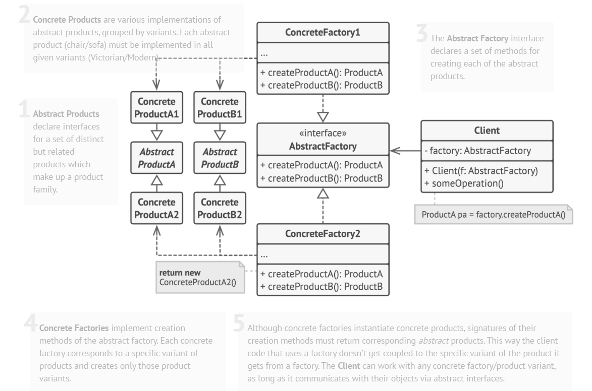

# Abstract Factory Pattern

## Definiție

Abstract Factory este un **pattern de proiectare creațional** care oferă o interfață pentru crearea unor **familii de obiecte înrudite sau dependente**, fără a specifica clasele lor concrete.
Este utilizat atunci când obiectele create trebuie să fie compatibile între ele și să aparțină aceleiași familii. Patternul separă logica de creare a obiectelor de logica de utilizare, astfel încât clientul lucrează doar cu interfețe, nu cu implementări concrete.

> Abstract Factory înseamnă crearea unor grupuri de obiecte înrudite printr-o interfață comună, fără a expune clasele concrete din spatele lor.

## Scop

Scopul principal este separarea clară între crearea obiectelor și utilizarea lor, garantarea compatibilității între produsele din aceeași familie și evitarea amestecării unor produse incompatibile. Patternul permite extinderea sistemului cu familii noi de produse fără a modifica codul client existent.

## Structură

- **AbstractFactory** declară metodele pentru crearea unei familii de produse. 
- **ConcreteFactory** implementează aceste metode și creează o familie concretă de produse. 
- **AbstractProductA / AbstractProductB** sunt interfețele produselor din familie. 
- **ConcreteProductA / ConcreteProductB** reprezintă implementările concrete ale produselor, corespunzătoare unei anumite fabrici concrete. 
- **Client** folosește doar fabrica abstractă și produsele abstracte, fără a depinde de clasele concrete.

## Problema identificată

Aplicația trebuie să lucreze cu mai multe familii de obiecte înrudite: pentru fiecare metodă de plată există două obiecte care trebuie să fie compatibile, plata și chitanța.
Dacă aceste obiecte ar fi create direct în clasa `Checkout`, clientul ar depinde de clasele concrete, iar la adăugarea unei metode noi de plată ar trebui modificată logica existentă. Ar exista și riscul de a combina din greșeală produse incompatibile, de exemplu `CryptoPayment` cu `StripeReceipt`.

## Soluția propusă

Abstract Factory introduce o fabrică abstractă, `PaymentFactory`, care declară metodele `createPayment()` și `createReceipt()`. Fiecare fabrică concretă produce doar obiecte din propria familie: `StripeFactory` creează plată și chitanță Stripe, iar `CryptoFactory` creează plată și chitanță Crypto.
Clientul (`Checkout`) primește o fabrică din exterior și folosește doar interfețele abstracte, fără să știe ce implementări concrete sunt folosite. Astfel se garantează automat compatibilitatea dintre plată și chitanță, iar familii noi (de exemplu PayPal) pot fi adăugate fără a modifica `Checkout`.

## Cazuri de utilizare

- Aplicația trebuie să lucreze cu mai multe familii de obiecte înrudite, fără a depinde de implementările lor concrete.
- Tipurile concrete ale obiectelor pot fi necunoscute la momentul proiectării sau se dorește extinderea sistemului în viitor.
- Trebuie asigurată compatibilitatea între obiectele din aceeași familie (ex. plată și chitanță).
- Se dorește evitarea combinării unor produse incompatibile.
- O clasă conține mai multe metode de creare a obiectelor, iar responsabilitatea de instanțiere trebuie separată.
- Aplicații mari, framework-uri sau sisteme configurabile, unde familia de obiecte folosită depinde de configurație, platformă sau mediu.

## Avantaje

- Garantează compatibilitatea între produsele din aceeași familie
- Reduce dependența dintre client și clasele concrete
- Respectă Single Responsibility Principle și Open/Closed Principle
- Ușor de extins cu familii noi de produse

## Dezavantaje

- Introduce mai multe interfețe și clase suplimentare
- Structura poate fi mai greu de înțeles la început, mai ales în proiecte mici
- Adăugarea unui produs nou (nu a unei familii noi) necesită modificarea tuturor fabricilor

## Concluzie

Abstract Factory este util atunci când trebuie create și folosite împreună mai multe familii de obiecte compatibile. Deși introduce un nivel suplimentar de complexitate, oferă o organizare clară, reduce dependențele și permite extinderea aplicației într-un mod controlat.