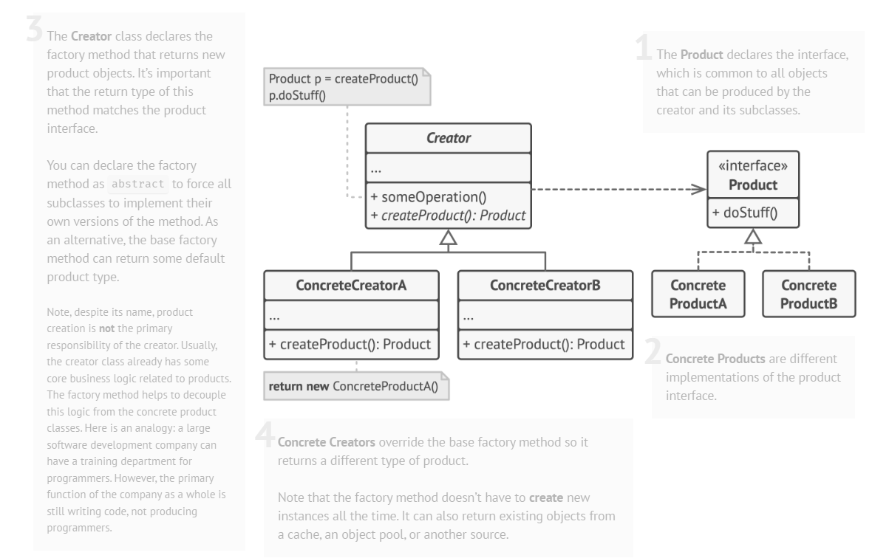

# Factory Method Pattern

## Definiție

Factory Method este un **pattern de proiectare creațional** care definește o metodă pentru crearea obiectelor, dar lasă **subclasele să decidă ce tip concret de obiect va fi creat**.
Este utilizat atunci când aplicația trebuie să creeze obiecte diferite, dar să lucreze cu ele printr-o interfață comună. Patternul separă logica de creare a obiectelor de logica principală care le utilizează.

> Factory Method înseamnă delegarea deciziei despre ce clasă concretă se instanțiază către subclase, printr-o metodă factory suprascrisă.

## Scop

Scopul principal este separarea codului de creare a obiectelor de codul care le utilizează, permițând extinderea aplicației cu noi tipuri de produse fără a modifica logica existentă. Patternul reduce dependența directă dintre creator și clasele concrete.

## Structură

- **Product** este interfața comună a obiectelor create; definește metodele pe care toate produsele concrete trebuie să le implementeze.
- **ConcreteProduct** implementează comportamentul definit de interfața Product.
- **Creator** este clasa abstractă care declară metoda factory și poate conține și logică comună ce folosește produsul creat.
- **ConcreteCreator** implementează metoda factory și decide ce produs concret se creează.
- **Client** folosește Creator-ul și lucrează cu produsul printr-o interfață abstractă, fără să depindă direct de clasele concrete.

## Problema identificată

Aplicația poate avea mai multe metode de plată, iar fiecare are o implementare diferită. Dacă obiectele concrete (de exemplu `PaypalPaymentProcessor` și `StripePaymentProcessor`) ar fi create direct în codul principal, aplicația ar deveni dependentă de clase concrete, iar adăugarea unei metode noi de plată ar necesita modificarea codului existent.

## Soluția propusă

Factory Method rezolvă problema prin separarea logicii de creare de logica de utilizare. Clasa abstractă `PaymentService` definește metoda factory `createProcessor()`, dar nu decide ce procesator concret va fi creat — decizia este transferată subclaselor `PaypalPaymentService` și `StripePaymentService`.
Codul principal lucrează cu abstracții (`PaymentService`, `PaymentProcessor`), fără să cunoască direct clasele concrete. O componentă auxiliară, `PaymentProvider`, centralizează selectarea serviciului potrivit în funcție de tipul primit, ascunzând alegerea claselor concrete față de client (`Main`).

## Cazuri de utilizare

- Nu se cunosc dinainte tipurile exacte de obiecte care trebuie create sau dependențele cu care va lucra codul.
- Se dorește separarea codului de creare a obiectelor de codul care le utilizează.
- Se dorește permiterea extinderii unei aplicații, biblioteci sau framework fără modificarea codului existent.
- Trebuie adăugate tipuri noi de obiecte (ex. metode noi de plată) fără a schimba logica principală.
- Se dorește centralizarea logicii de creare a obiectelor într-un singur loc și evitarea duplicării ei.
- Aplicații care lucrează cu resurse externe sau obiecte costisitoare de creat (conexiuni la baze de date, fișiere, resurse de rețea).

## Avantaje

- Reduce dependența directă dintre creator și clasele concrete
- Respectă Single Responsibility Principle (logica de creare e separată de logica principală)
- Respectă Open/Closed Principle (se pot adăuga tipuri noi fără a modifica codul existent)
- Ușor de extins și de întreținut pentru aplicații cu mai multe variante ale aceluiași tip de obiect

## Dezavantaje

- Introduce mai multe clase și subclase, ceea ce crește complexitatea
- Ierarhia mai mare de clase poate îngreuna înțelegerea inițială a proiectului
- Nu este justificat în aplicații foarte simple, unde nu e nevoie de flexibilitate în crearea obiectelor

## Concluzie

Factory Method este util atunci când aplicația trebuie să creeze obiecte diferite, dar să le utilizeze printr-o interfață comună. În exemplul prezentat, patternul permite procesarea plăților prin PayPal și Stripe fără ca logica principală să depindă direct de clasele concrete, menținând aplicația flexibilă și ușor de extins.