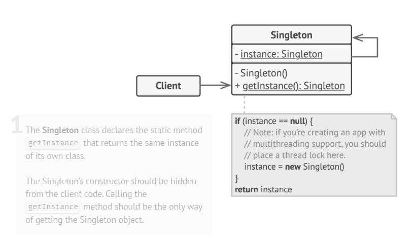

# Singleton Pattern

## Definiție

Singleton este un **pattern de proiectare creațional** care asigură faptul că o clasă are **o singură instanță** în toată aplicația. Acesta oferă un punct global de acces la acea instanță, astfel încât toate componentele aplicației să folosească același obiect.
Este utilizat atunci când trebuie controlată strict o resursă comună, cum ar fi un logger, o configurație globală sau o conexiune la baza de date.

> Singleton înseamnă garantarea faptului că o clasă are o singură instanță și oferirea unui punct global de acces la aceasta.

## Scop

Scopul principal este controlul strict asupra instanțierii unei clase, evitarea creării unor resurse duplicate și oferirea unui acces unitar la o resursă comună din orice parte a aplicației, fără a folosi variabile globale clasice.

## Structură

- **Singleton** este clasa care controlează propria instanțiere. Conține o variabilă statică pentru instanța unică, un constructor privat și o metodă statică de acces.
- **instance** este variabila statică ce păstrează singurul obiect al clasei.
- **Constructorul privat** împiedică instanțierea directă din exterior (`new`).
- **getInstance()** este punctul global de acces: creează instanța doar dacă nu există deja, apoi returnează mereu același obiect.
- **Client** obține și folosește instanța doar prin `getInstance()`, fără a crea obiectul direct.

## Problema identificată

Anumite clase trebuie să existe într-o singură instanță în toată aplicația. Dacă fiecare componentă ar crea propriul obiect (de exemplu un `Logger`), mesajele ar putea fi gestionate neuniform, ar putea apărea resurse duplicate, iar comportamentul aplicației ar deveni inconsistent între diferite părți ale codului.

## Soluția propusă

Singleton rezolvă problema prin controlarea instanțierii clasei. Constructorul este declarat `private`, astfel încât obiectul nu poate fi creat direct din exterior. Singura modalitate de a obține instanța este metoda statică `getInstance()`, care creează obiectul o singură dată (lazy initialization) și apoi returnează mereu aceeași referință.
În implementări multi-thread, se folosește `synchronized` cu dublă verificare (`double-checked locking`) pentru a preveni crearea mai multor instanțe atunci când mai multe fire de execuție ajung simultan la metoda `getInstance()`.

## Cazuri de utilizare

- O clasă trebuie să aibă o singură instanță în toată aplicația (logger, configurare globală, conexiune la baza de date, cache manager).
- Este nevoie de control strict asupra unei resurse comune, evitând variabilele globale clasice.
- Se dorește acces unitar la aceeași instanță din diferite părți ale aplicației.
- Trebuie garantat că instanța nu poate fi înlocuită sau duplicată din exterior.

## Avantaje

- Garantează existența unei singure instanțe a clasei
- Oferă un punct global de acces la resursa comună
- Permite inițializare lazy (obiectul e creat doar când e necesar)
- Simplifică gestionarea resurselor comune (logger, configurări, conexiuni)

## Dezavantaje

- Poate încălca Single Responsibility Principle, deoarece clasa își controlează atât instanțierea, cât și logica proprie
- Necesită tratament special (synchronized/double-checked locking) în aplicații multi-thread
- Testarea unitară e mai dificilă, deoarece constructorul e privat și metoda de acces e statică

## Concluzie

Singleton este util atunci când o resursă trebuie să existe într-o singură instanță controlată global, precum loggerii, configurările sau conexiunile comune. Deși introduce riscuri legate de responsabilitate unică și testabilitate, oferă un mecanism simplu și eficient de a evita duplicarea resurselor și de a asigura consistența în toată aplicația.